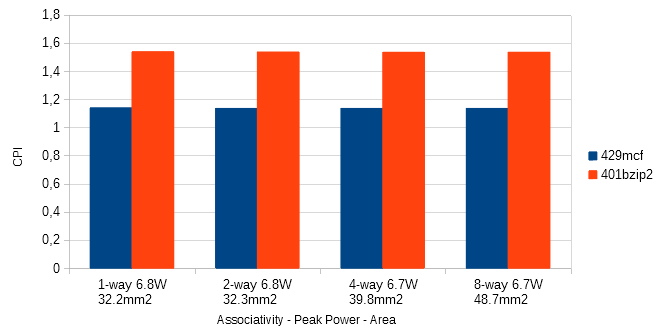
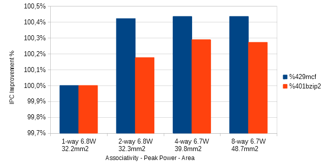
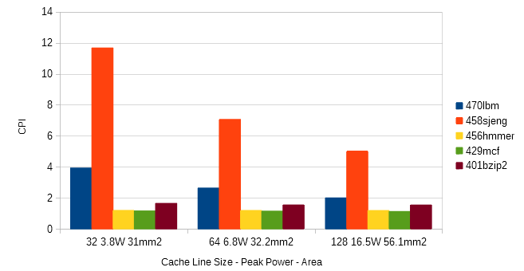
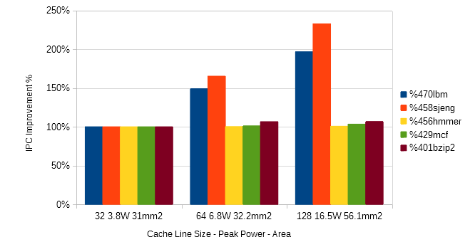
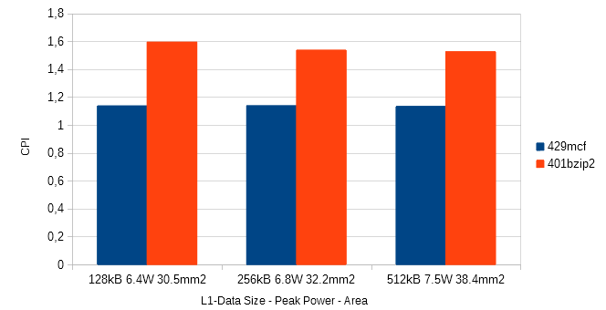
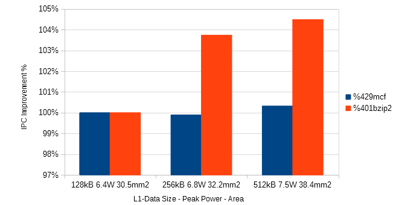
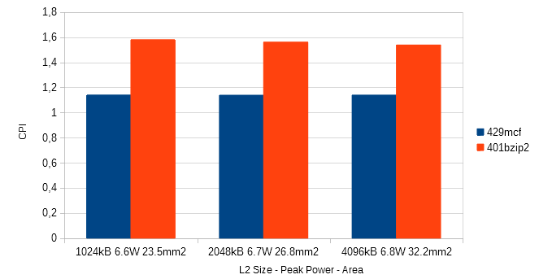
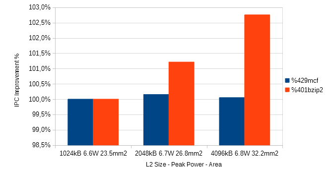

# 3η Εργασία Αρχιτεκτονικής Προηγμένων Υπολογιστών
_του Βασιλείου Μπεσλεμέ και του Διονυσίου Δανιήλ Πλέσσα_ 
[vampesle@ece.auth.gr](mailto:vampesle@ece.auth.gr), [dplessas@ece.auth.gr](mailto:dplessas@ece.auth.gr) 
9862, 9768

-------------------------------------------

## Βήμα 1ο

### 1.
Σύμφωνα με το [αρχικό paper](https://www.hpl.hp.com/research/mcpat/micro09.pdf), η επικύρωση των αποτελεσμάτων του McPAT έγινε με τη σύγκρισή τους με δημοσιευμένα δεδομένα για τους επεξεργαστές:
* SPARC Niagara (90nm, 1.2GHz, 1.2V)
* SPARC Niagara2 (65nm, 1.4GHz, 1.1V)
* Intel Xeon (65nm, 3.4GHz, 1.25V)
* Alpha 21364 (180nm, 1.2GHz, 1.5V)

Τα δεδομένα που χρησιμοποιήθηκαν, εκτός των άλλων, περιλαμβάνουν το ρυθμό ρολογιού, θερμοκρασίες λειτουργίας καθώς και άλλες αρχιτεκτονικές παραμέτρους.

Μελετήθηκαν η απόλυτη και η σχετική ακρίβεια των αποτελεσμάτων, τα οποία, εν τέλει, είναι αρκετά κοντά στα δημοσιευμένα δεδομένα.

### 2.
Υπάρχουν τρεις ισχύες οι οποίες απαρτίζουν τη συνολική ισχύ που καταναλώνει ένας επεξεργαστής, και αυτές είναι:
* Dynamic power: η δυναμική ισχύς είναι το άθροισμα δύο επιμέρους ισχύων, των:
	- Switching power: η ισχύς που καταναλώνεται στη φόρτιση/εκφόρτιση χωρητικοτήτων, όπως για παράδειγμα πυκνωτών αλλά και των πυλών MOSFETs.
	- Short-circuit power: η ισχύς που καταναλώνεται κατά το στιγμιαίο βραχυκύκλωμα της τάσης τροφοδοσίας με την γείωση, καθώς ένα MOSFET αλλάζει κατάσταση.
* Static/leakage power: η ισχύς που καταναλώνεται από ρεύματα διαρροών, π.χ. DC ρεύματα ανάστροφης πόλωσης διόδων, διαρροής πυκνωτών, διαρροής πύλης-πηγής (Igss) και διαρροής εκροής-πηγής (Ιdss) των MOSFETs.

Αρκετά ενδιαφέρον είναι το γεγονός ότι σε αρχιτεκτονικές μικρότερες των 90nm, η ισχύς διαρροής υπερέχει των άλλων τύπων ισχύων, ενώ σε μεγαλύτερες των 90nm, η ισχύς switching είναι αυτή που ευθύνεται για την κατανάλωση του μεγαλύτερου ποσοστού της ενέργειας. 

Κατά την εκτέλεση διαφορετικών προγραμμάτων, θα αναμέναμε το πιο "βαρύ" πρόγραμμα, δηλαδή αυτό που χρησιμοποιεί τον επεξεργαστή για μεγαλύτερο χρονικό διάστημα (μεγαλύτερο CPU time), να καταναλώνει μεγαλύτερη δυναμική ισχύ, αφού οδηγεί τα transistors του επεξεργαστή σε περισσότερες εναλλαγές κατάστασης. Από την άλλη, όσο μεγαλύτερο χρόνο εκτέλεσης έχει ένα πρόγραμμα (χωρίς να αυξάνεται απαραίτητα το CPU time, όπως για παράδειγμα στις καθυστερήσεις που οφείλονται στα περιφερειακά και την αλληλεπίδραση του χρήστη), τόσο αυξάνεται η ισχύς διαρροής, η οποία είναι κυρίαρχη για επεξεργαστές με transistors μικρότερου μεγέθους.

### 3.
Στην περίπτωση που στόχος της συσκευής είναι η εκτέλεση μιας συγκεκριμένης διεργασίας, ύστερα από την οποία ο επεξεργαστής θα αδρανοποιείται, τη μεγαλύτερη διάρκεια ζωής μπαταρίας θα έχει η συσκευή με τον πιο ενεργειακά αποδοτικό επεξεργαστή, δηλαδή αυτόν που μπορεί να παρέχει μεγαλύτερη υπολογιστική ισχύ ανά μονάδα ενέργειας. Το τελευταίο είναι ένα κριτήριο που δεν εξαρτάται από το TDP (thermal power design) της CPU. Σε περίπτωση που η χρήση του συστήματος επαφίεται στον χρήστη (όπως γίνεται με τους προσωπικούς υπολογιστές), ο οποίος συχνά επιλέγει πιο απαιτητικό λογισμικό, ανάλογα με τις δυνατότητες του συστήματος που διαθέτει, η επιλογή του δεύτερου επεξεργαστή ενδεχομένως να οδηγούσε σε μικρότερη διάρκεια μπαταρίας, παρά το γεγονός ότι μπορεί να είναι πιο αποδοτικός.

To McPAT από μόνο του, δεν είναι αρκετό για να αποφασίσουμε για την ενεργειακή αποδοτικότητα ενός επεξεργαστή. Για το τελευταίο, θα μας ήταν απαραίτητο να γνωρίζουμε και το χρόνο εκτέλεσης ενός benchmark για παράδειγμα, ώστε να υπολογίσουμε ένα μέγεθος όπως το PDP (Power Delay Product) ή το EDP (Energy Delay Product), το οποίο θα ήταν ενδεικτικό της ενεργειακής αποδοτικότητας του συστήματος. Τέτοια δεδομένα, θα μπορούσαμε να εξάγουμε από τον προσομοιωτή Gem5 για παράδειγμα.

### 4.
Παρατηρώντας τα αποτελέσματα του McPAT για τους δύο επεξεργαστές, προκύπτει ότι η ισχύς διαρροής του Xeon (36.832W) είναι αρκετά μεγαλύτερη από αυτή του A9 (0.109W). Δεδομένου ότι το πρόγραμμα τρέχει 40 φορές πιο γρήγορα στον Xeon, υπολογίζουμε ότι η ελάχιστη δυνατή ενέργεια που απαιτείται για την εκτέλεση του προγράμματος είναι `36.832 * (1 / 40) = 0.921` (μονάδες χρόνου *W), ενώ για τον A9 `0.109 * 1 = 0.109` (μονάδες χρόνου *W).

Στους παραπάνω υπολογισμούς, χρησιμοποιήσαμε μόνο την ισχύ διαρροής, αφού αυτή, σε αντίθεση με τη δυναμική ισχύ, δεν επηρεάζεται από το είδος του προγράμματος που εκτελείται και επειδή είναι η μόνη μορφή ισχύος που καταναλώνεται ακόμα και αν ο επεξεργαστής είναι σε αδράνεια. Ωστόσο, η CPU Xeon θα μπορούσε να έχει αρκετά μικρότερη δυναμική ισχύ από την A9 και να ανατρέπει τελικά το αποτέλεσμα (για ένα συγκεκριμένο χρονικό παράθυρο, όπου η μεγαλύτερη ισχύς διαρροής του Xeon δε θα ανέτρεπε, ξανά, το αποτέλεσμα). Πραγματοποιώντας τους ίδιους υπολογισμούς, χρησιμοποιώντας τη δυναμική ισχύ αυτή τη φορά, καταλήγουμε στο ίδιο συμπέρασμα. Επομένως, ανεξάρτητα από το πρόγραμμα που χρησιμοποιείται, θα μπορούσαμε να πούμε ότι ο Α9 είναι πιο ενεργειακά αποδοτικός, παρότι είναι αρκετά πιο αργός από τον Intel Xeon.

[Πηγή](https://semiengineering.com/knowledge_centers/low-power/low-power-design/power-consumption/)

## Βήμα 2ο

### 1.

Το energy υπολογίζεται με ολοκλήρωση της ισχύος στον χρόνο εκτέλεσης. Χρησιμοποιήσαμε το print_energy.py που υπολογίζει το energy πολλαπλασιάζοντας τον χρόνο εκτέλεσης με το άθροισμα δυναμικής και ισχύος διαρροής: ` energy = (leakage + dynamic)*runtime `. Το runtime προέρχεται από τα αποτελέσματα των προσομοιώσεων του gem5 ενώ τα leakage και dynamic προέρχονται από τα αποτελέσματα του McPat.

### 2.

Αποτελέσματα
------------

Οι προσομοιώσεις που εκτελέστηκαν είναι για τα παρακάτω συστήματα:
|Num.	| Τitle | L1d size (KB) | L1d Assoc. | L1i size (KB) | L1i Assoc. | L2 size	 (KB) | L2 Assoc.  | Cache Line (B) |
| ------ | ----- | --------- | ------------- | --------- |------------- | --------- | ------------- | --------- | 
| **1** | **Control** | 256 | 1 | 256 | 1 | 4096 | 1 | 64 |
| **2** | L1 Alloc. Test | 128 | 1 | 256 | 1 | 4096 | 1 | 64 |
| **3** | L1 Alloc. Test | 256 | 1 | 128 | 1 | 4096 | 1 | 64 |
| **4** | L2 Test | 256 | 1 | 256 | 1 | 2048 | 1 | 64 |
| **5** | L2 Test | 256 | 1 | 256 | 1 | 1024 | 1 | 64 |
| **6** | L1d Test | 512 | 1 | 256 | 1 | 4096 | 1 | 64 |
| **7** | C. Line Test | 256 | 1 | 256 | 1 | 4096 | 1 | 32 |
| **8** | C. Line Test | 256 | 1 | 256 | 1 | 4096 | 1 | 128|
| **9** | Assoc. Test | 256 | 2 | 256 | 2 | 4096 | 2 | 64 |
| **10**| Assoc. Test | 256 | 4 | 256 | 2 | 4096 | 4 | 64 |
| **11**| Assoc. Test | 256 | 8 | 256 | 8 | 4096 | 8 | 64 |
| **12**| Perfect Test | 256 | 4 | 256 | 4 | 4096 | 4 | 128 |
| **13**| Perfect Final | 256 | 4 | 256 | 4 | 4096 | 4 | 256 |
| **14** | **Ideal** | 64 | 4 | 64 | 4 | 1024 | 4 | 256 |

Τα συστήματα 1 έως 12 είναι τα δοκιμαστικά συστήματα από το δεύτερο μέρος της προηγούμενης άσκησης, το σύστημα 13 είναι το μέγιστων επιδόσεων ανεξαρτήτου κόστους ενώ το  σύστημα 14 είναι το ιδανικό σύστημα που υπολογίσαμε με την συνάρτηση κόστους που υλοποιήσαμε.

Machine 1
-------------

| Benchmark           | 401bzip2      | 429mcf       | 456hmmer     | 458sjeng      | 470lbm        |
|---------------------|---------------|--------------|--------------|---------------|---------------|
|**CPI**              |  1.53747      |  1.13880     |  1.18263     |  7.05754      |  2.62833      |
|**Energy**           | 479.262916mJ | 353.673161mJ| 374.025984mJ| 2029.421792mJ| 772.186533mJ |
|**Core Data**        |               |              |              |               |               |
|**Area**             | 17.5954 mm^2  | 17.5954 mm^2 | 17.5954 mm^2 | 17.5954 mm^2  | 17.5954 mm^2  |
|**Subthreshold Leakage**| 2.50962W     | 2.50962W    | 2.50962W    | 2.50962W     | 2.50962W     |
|**Gate Leakage**     | 0.0189625W   | 0.0189625W  | 0.0189625W  | 0.0189625W   | 0.0189625W   |
|**Runtime Dynamic**  | 0.499585W    | 0.500981W   | 0.559397W   | 0.207781W    | 0.297759W    |
|**L2 Data**          |               |              |              |               |               |
|**Area**             | 12.8813 mm^2  | 12.8813 mm^2 | 12.8813 mm^2 | 12.8813 mm^2  | 12.8813 mm^2  |
|**Subthreshold Leakage**| 0.00886875W  | 0.00886875W | 0.00886875W | 0.00886875W  | 0.00886875W  |
|**Gate Leakage**     | 0.00107422W  | 0.00107422W | 0.00107422W | 0.00107422W  | 0.00107422W  |
|**Runtime Dynamic**  | 0.0104672W   | 0.000868803W| 0.00024668W | 0.025636W    | 0.0079842W   |

Machine 2
-------------

| Benchmark           | 401bzip2      | 429mcf       | 456hmmer     | 458sjeng      | 470lbm        |
|---------------------|---------------|--------------|--------------|---------------|---------------|
|**CPI**              |  1.59488      |  1.13756     |  1.18990     |  7.05754      |  2.63117      |
|**Energy**           | 448.583068mJ | 319.200019mJ| 340.093648mJ| 1847.874082mJ| 702.117716mJ |
|**Core Data**        |               |              |              |               |               |
|**Area**             | 15.9377 mm^2  | 15.9377 mm^2 | 15.9377 mm^2 | 15.9377 mm^2  | 15.9377 mm^2  |
|**Subthreshold Leakage**| 2.28171W     | 2.28171W    | 2.28171W    | 2.28171W     | 2.28171W     |
|**Gate Leakage**     | 0.0173334W   | 0.0173334W  | 0.0173334W  | 0.0173334W   | 0.0173334W   |
|**Runtime Dynamic**  | 0.415802W    | 0.430686W   | 0.48201W    | 0.18007W     | 0.257798W    |
|**L2 Data**          |               |              |              |               |               |
|**Area**             | 12.8813 mm^2  | 12.8813 mm^2 | 12.8813 mm^2 | 12.8813 mm^2  | 12.8813 mm^2  |
|**Subthreshold Leakage**| 0.00886875W  | 0.00886875W | 0.00886875W | 0.00886875W  | 0.00886875W  |
|**Gate Leakage**     | 0.00107422W  | 0.00107422W | 0.00107422W | 0.00107422W  | 0.00107422W  |
|**Runtime Dynamic**  | 0.0193497W   | 0.00107155W | 0.00270827W | 0.0256472W   | 0.0080438W   |

Machine 3
-------------

| Benchmark           | 401bzip2      | 429mcf       | 456hmmer     | 458sjeng      | 470lbm        |
|---------------------|---------------|--------------|--------------|---------------|---------------|
|**CPI**              |  1.53748      |  1.13559     |  1.18263     |  7.05756      |  2.62833      |
|**Energy**           | 443.974563mJ | 325.841879mJ| 346.879665mJ| 1867.427376mJ| 714.836635mJ |
|**Core Data**        |               |              |              |               |               |
|**Area**             | 16.0884 mm^2  | 16.0884 mm^2 | 16.0884 mm^2 | 16.0884 mm^2  | 16.0884 mm^2  |
|**Subthreshold Leakage**| 2.28171W     | 2.28171W    | 2.28171W    | 2.28171W     | 2.28171W     |
|**Gate Leakage**     | 0.0173334W   | 0.0173334W  | 0.0173334W  | 0.0173334W   | 0.0173334W   |
|**Runtime Dynamic**  | 0.499582W    | 0.493406W   | 0.559389W   | 0.20778W     | 0.297759W    |
|**L2 Data**          |               |              |              |               |               |
|**Area**             | 12.8813 mm^2  | 12.8813 mm^2 | 12.8813 mm^2 | 12.8813 mm^2  | 12.8813 mm^2  |
|**Subthreshold Leakage**| 0.00886875W  | 0.00886875W | 0.00886875W | 0.00886875W  | 0.00886875W  |
|**Gate Leakage**     | 0.00107422W  | 0.00107422W | 0.00107422W | 0.00107422W  | 0.00107422W  |
|**Runtime Dynamic**  | 0.0104686W   | 0.00170562W | 0.000254125W| 0.0256361W   | 0.0193248W   |

Machine 4
-------------

| Benchmark           | 401bzip2      | 429mcf       | 456hmmer     | 458sjeng      | 470lbm        |
|---------------------|---------------|--------------|--------------|---------------|---------------|
|**CPI**              |  1.56092      |  1.13766     |  1.18262     |  7.05935      |  2.63077      |
|**Energy**           | 484.395309mJ | 351.834552mJ| 373.450192mJ| 2023.243595mJ| 771.599882mJ |
|**Core Data**        |               |              |              |               |               |
|**Area**             | 17.5954 mm^2  | 17.5954 mm^2 | 17.5954 mm^2 | 17.5954 mm^2  | 17.5954 mm^2  |
|**Subthreshold Leakage**| 2.50962W     | 2.50962W    | 2.50962W    | 2.50962W     | 2.50962W     |
|**Gate Leakage**     | 0.0189625W   | 0.0189625W  | 0.0189625W  | 0.0189625W   | 0.0189625W   |
|**Runtime Dynamic**  | 0.492039W    | 0.492507W   | 0.559402W   | 0.207727W    | 0.297483W    |
|**L2 Data**          |               |              |              |               |               |
|**Area**             | 7.47733 mm^2  | 7.47733 mm^2 | 7.47733 mm^2 | 7.47733 mm^2  | 7.47733 mm^2  |
|**Subthreshold Leakage**| 0.00460747W  | 0.00460747W | 0.00460747W | 0.00460747W  | 0.00460747W  |
|**Gate Leakage**     | 0.000556536W | 0.000556536W| 0.000556536W| 0.000556536W | 0.000556536W |
|**Runtime Dynamic**  | 0.0074136W   | 0.000731789W| 0.000178734W| 0.0208712W   | 0.00777041W  |

Machine 5
-------------

| Benchmark           | 401bzip2      | 429mcf       | 456hmmer     | 458sjeng      | 470lbm        |
|---------------------|---------------|--------------|--------------|---------------|---------------|
|**CPI**              |  1.57986      |  1.13940     |  1.18262     |  7.06012      |  2.63262      |
|**Energy**           | 488.872194mJ | 352.090438mJ| 373.205506mJ| 2019.207734mJ| 771.564619mJ |
|**Core Data**        |               |              |              |               |               |
|**Area**             | 17.5954 mm^2  | 17.5954 mm^2 | 17.5954 mm^2 | 17.5954 mm^2  | 17.5954 mm^2  |
|**Subthreshold Leakage**| 2.50962W     | 2.50962W    | 2.50962W    | 2.50962W     | 2.50962W     |
|**Gate Leakage**     | 0.0189625W   | 0.0189625W  | 0.0189625W  | 0.0189625W   | 0.0189625W   |
|**Runtime Dynamic**  | 0.486153W    | 0.491757W   | 0.559402W   | 0.207705W    | 0.297274W    |
|**L2 Data**          |               |              |              |               |               |
|**Area**             | 4.17438 mm^2  | 4.17438 mm^2 | 4.17438 mm^2 | 4.17438 mm^2  | 4.17438 mm^2  |
|**Subthreshold Leakage**| 0.00275444W  | 0.00275444W | 0.00275444W | 0.00275444W  | 0.00275444W  |
|**Gate Leakage**     | 0.000392649W | 0.000392649W| 0.000392649W| 0.000392649W | 0.000392649W |
|**Runtime Dynamic**  | 0.00532681W  | 0.000648279W| 0.000120289W| 0.0168171W   | 0.00764785W  |

Machine 6
-------------

| Benchmark           | 401bzip2      | 429mcf       | 456hmmer     | 458sjeng      | 470lbm        |
|---------------------|---------------|--------------|--------------|---------------|---------------|
|**CPI**              |  1.52644      |  1.13392     |  1.18216     |  7.03832      |  2.62712      |
|**Energy**           | 565.397385mJ | 417.055032mJ| 444.178980mJ| 2391.223349mJ| 912.449275mJ |
|**Core Data**        |               |              |              |               |               |
|**Area**             | 23.8415 mm^2  | 23.8415 mm^2 | 23.8415 mm^2 | 23.8415 mm^2  | 23.8415 mm^2  |
|**Subthreshold Leakage**| 2.96773W     | 2.96773W    | 2.96773W    | 2.96773W     | 2.96773W     |
|**Gate Leakage**     | 0.022475W    | 0.022475W   | 0.022475W   | 0.022475W    | 0.022475W    |
|**Runtime Dynamic**  | 0.627496W    | 0.611864W   | 0.69253W    | 0.268131W    | 0.371406W    |
|**L2 Data**          |               |              |              |               |               |
|**Area**             | 12.8813 mm^2  | 12.8813 mm^2 | 12.8813 mm^2 | 12.8813 mm^2  | 12.8813 mm^2  |
|**Subthreshold Leakage**| 0.00886875W  | 0.00886875W | 0.00886875W | 0.00886875W  | 0.00886875W  |
|**Gate Leakage**     | 0.00107422W  | 0.00107422W | 0.00107422W | 0.00107422W  | 0.00107422W  |
|**Runtime Dynamic**  | 0.00768571W  | 0.00067579W | 0.000166747W| 0.0254449W   | 0.00793762W  |

Machine 7
-------------

| Benchmark           | 401bzip2      | 429mcf       | 456hmmer     | 458sjeng      | 470lbm        |
|---------------------|---------------|--------------|--------------|---------------|---------------|
|**CPI**              |  1.63820      |  1.15266     |  1.18598     | 11.66498      |  3.91979      |
|**Energy**           | 330.179210mJ | 234.703784mJ| 244.071482mJ| 2186.346204mJ| 747.404782mJ |
|**Core Data**        |               |              |              |               |               |
|**Area**             | 16.0588 mm^2  | 16.0588 mm^2 | 16.0588 mm^2 | 16.0588 mm^2  | 16.0588 mm^2  |
|**Subthreshold Leakage**| 1.66546W     | 1.66546W    | 1.66546W    | 1.66546W     | 1.66546W     |
|**Gate Leakage**     | 0.0113064W   | 0.0113064W  | 0.0113064W  | 0.0113064W   | 0.0113064W   |
|**Runtime Dynamic**  | 0.252279W    | 0.28372W    | 0.307516W   | 0.0711894W   | 0.112725W    |
|**L2 Data**          |               |              |              |               |               |
|**Area**             | 13.211 mm^2   | 13.211 mm^2  | 13.211 mm^2  | 13.211 mm^2   | 13.211 mm^2   |
|**Subthreshold Leakage**| 0.00816516W  | 0.00816516W | 0.00816516W | 0.00816516W  | 0.00816516W  |
|**Gate Leakage**     | 0.000776381W | 0.000776381W| 0.000776381W| 0.000776381W | 0.000776381W |
|**Runtime Dynamic**  | 0.00626062W  | 0.0005893W  | 0.000165917W| 0.00554513W  | 0.00464186W  |

Machine 8
-------------

| Benchmark           | 401bzip2      | 429mcf       | 456hmmer     | 458sjeng      | 470lbm        |
|---------------------|---------------|--------------|--------------|---------------|---------------|
|**CPI**              |  1.53311      |  1.11498     |  1.17817     |  5.01106      |  1.99147      |
|**Energy**           | 1004.262590mJ| 720.447672mJ| 783.488522mJ| 3025.861934mJ| 1244.418099mJ|
|**Core Data**        |               |              |              |               |               |
|**Area**             | 36.1509 mm^2  | 36.1509 mm^2 | 36.1509 mm^2 | 36.1509 mm^2  | 36.1509 mm^2  |
|**Subthreshold Leakage**| 5.1311W      | 5.1311W     | 5.1311W     | 5.1311W      | 5.1311W      |
|**Gate Leakage**     | 0.0422332W   | 0.0422332W  | 0.0422332W  | 0.0422332W   | 0.0422332W   |
|**Runtime Dynamic**  | 1.27123W     | 1.20803W    | 1.3984W     | 0.711896W    | 0.96084W     |
|**L2 Data**          |               |              |              |               |               |
|**Area**             | 18.1823 mm^2  | 18.1823 mm^2 | 18.1823 mm^2 | 18.1823 mm^2  | 18.1823 mm^2  |
|**Subthreshold Leakage**| 0.0116336W   | 0.0116336W  | 0.0116336W  | 0.0116336W   | 0.0116336W   |
|**Gate Leakage**     | 0.00178194W  | 0.00178194W | 0.00178194W | 0.00178194W  | 0.00178194W  |
|**Runtime Dynamic**  | 0.0253606W   | 0.00193643W | 0.000437962W| 0.0477418W   | 0.0174254W   |

Machine 9
-------------

| Benchmark           | 401bzip2      | 429mcf       | 456hmmer     | 458sjeng      | 470lbm        |
|---------------------|---------------|--------------|--------------|---------------|---------------|
|**CPI**              |  1.53477      |  1.13403     |  1.18143     |  7.03840      |  2.62076      |
|**Energy**           | 479.634865mJ | 352.788681mJ| 375.154930mJ| 2022.206927mJ| 773.380510mJ |
|**Core Data**        |               |              |              |               |               |
|**Area**             | 17.6483 mm^2  | 17.6483 mm^2 | 17.6483 mm^2 | 17.6483 mm^2  | 17.6483 mm^2  |
|**Subthreshold Leakage**| 2.52133W     | 2.52133W    | 2.52133W    | 2.52133W     | 2.52133W     |
|**Gate Leakage**     | 0.0190255W   | 0.0190255W  | 0.0190255W  | 0.0190255W   | 0.0190255W   |
|**Runtime Dynamic**  | 0.500792W    | 0.494643W   | 0.560601W   | 0.208611W    | 0.298971W    |
|**L2 Data**          |               |              |              |               |               |
|**Area**             | 12.8774 mm^2  | 12.8774 mm^2 | 12.8774 mm^2 | 12.8774 mm^2  | 12.8774 mm^2  |
|**Subthreshold Leakage**| 0.00887322W  | 0.00887322W | 0.00887322W | 0.00887322W  | 0.00887322W  |
|**Gate Leakage**     | 0.00107583W  | 0.00107583W | 0.00107583W | 0.00107583W  | 0.00107583W  |
|**Runtime Dynamic**  | 0.0054123W   | 0.000714191W| 2.96883e-05W| 0.0104919W   | 0.0079505W   |

Machine 10
-------------

| Benchmark           | 401bzip2      | 429mcf       | 456hmmer     | 458sjeng      | 470lbm        |
|---------------------|---------------|--------------|--------------|---------------|---------------|
|**CPI**              |  1.53304      |  1.13387     |  1.18135     |  7.03865      |  2.62076      |
|**Energy**           | 432.092289mJ | 317.346593mJ| 339.501954mJ| 1781.298606mJ| 686.255441mJ |
|**Core Data**        |               |              |              |               |               |
|**Area**             | 24.8691 mm^2  | 24.8691 mm^2 | 24.8691 mm^2 | 24.8691 mm^2  | 24.8691 mm^2  |
|**Subthreshold Leakage**| 2.1569W      | 2.1569W     | 2.1569W     | 2.1569W      | 2.1569W      |
|**Gate Leakage**     | 0.0149794W   | 0.0149794W  | 0.0149794W  | 0.0149794W   | 0.0149794W   |
|**Runtime Dynamic**  | 0.562776W    | 0.550879W   | 0.627432W   | 0.234476W    | 0.334798W    |
|**L2 Data**          |               |              |              |               |               |
|**Area**             | 13.1659 mm^2  | 13.1659 mm^2 | 13.1659 mm^2 | 13.1659 mm^2  | 13.1659 mm^2  |
|**Subthreshold Leakage**| 0.0089513W   | 0.0089513W  | 0.0089513W  | 0.0089513W   | 0.0089513W   |
|**Gate Leakage**     | 0.0010833W   | 0.0010833W  | 0.0010833W  | 0.0010833W   | 0.0010833W   |
|**Runtime Dynamic**  | 0.00524748W  | 0.000706485W| 7.67215e-06W| 0.0106507W   | 0.00807119W  |

Machine 11
-------------

| Benchmark           | 401bzip2      | 429mcf       | 456hmmer     | 458sjeng      | 470lbm        |
|---------------------|---------------|--------------|--------------|---------------|---------------|
|**CPI**              |  1.53330      |  1.13387     |  1.18134     |  7.03906      |  2.62076      |
|**Energy**           | 505.824863mJ | 370.237786mJ| 397.664856mJ| 2065.876826mJ| 798.598511mJ |
|**Core Data**        |               |              |              |               |               |
|**Area**             | 33.6123 mm^2  | 33.6123 mm^2 | 33.6123 mm^2 | 33.6123 mm^2  | 33.6123 mm^2  |
|**Subthreshold Leakage**| 2.51266W     | 2.51266W    | 2.51266W    | 2.51266W     | 2.51266W     |
|**Gate Leakage**     | 0.0177753W   | 0.0177753W  | 0.0177753W  | 0.0177753W   | 0.0177753W   |
|**Runtime Dynamic**  | 0.684361W    | 0.658608W   | 0.761073W   | 0.279748W    | 0.40463W     |
|**L2 Data**          |               |              |              |               |               |
|**Area**             | 13.3224 mm^2  | 13.3224 mm^2 | 13.3224 mm^2 | 13.3224 mm^2  | 13.3224 mm^2  |
|**Subthreshold Leakage**| 0.00910636W  | 0.00910636W | 0.00910636W | 0.00910636W  | 0.00910636W  |
|**Gate Leakage**     | 0.00110378W  | 0.00110378W | 0.00110378W | 0.00110378W  | 0.00110378W  |
|**Runtime Dynamic**  | 0.00527964W  | 0.000709866W| 4.11821e-06W| 0.0107879W   | 0.00817559W  |

Machine 12
-------------

| Benchmark           | 401bzip2      | 429mcf       | 456hmmer     | 458sjeng      | 470lbm        |
|---------------------|---------------|--------------|--------------|---------------|---------------|
|**CPI**              |  1.52692      |  1.11289     |  1.17709     |  4.97248      |  1.98911      |
|**Energy**           | 759.740423mJ | 543.732892mJ| 599.778357mJ| 2186.578465mJ| 925.175516mJ |
|**Core Data**        |               |              |              |               |               |
|**Area**             | 47.5091 mm^2  | 47.5091 mm^2 | 47.5091 mm^2 | 47.5091 mm^2  | 47.5091 mm^2  |
|**Subthreshold Leakage**| 3.46055W     | 3.46055W    | 3.46055W    | 3.46055W     | 3.46055W     |
|**Gate Leakage**     | 0.0253457W   | 0.0253457W  | 0.0253457W  | 0.0253457W   | 0.0253457W   |
|**Runtime Dynamic**  | 1.39563W     | 1.32014W    | 1.53157W    | 0.781482W    | 1.05094W     |
|**L2 Data**          |               |              |              |               |               |
|**Area**             | 18.5988 mm^2  | 18.5988 mm^2 | 18.5988 mm^2 | 18.5988 mm^2  | 18.5988 mm^2  |
|**Subthreshold Leakage**| 0.0117038W   | 0.0117038W  | 0.0117038W  | 0.0117038W   | 0.0117038W   |
|**Gate Leakage**     | 0.00179366W  | 0.00179366W | 0.00179366W | 0.00179366W  | 0.00179366W  |
|**Runtime Dynamic**  | 0.0135256W   | 0.0013786W  | 1.24943e-05W| 0.0242844W   | 0.0171283W   |

Machine 13
-------------

| Benchmark           | 401bzip2      | 429mcf       | 456hmmer     | 458sjeng      | 470lbm        |
|---------------------|---------------|--------------|--------------|---------------|---------------|
|**CPI**              |  1.51798      |  1.09894     |  1.17546     |  3.71467      |  1.65385      |
|**Energy**           | 803.770410mJ | 578.313878mJ| 627.521133mJ| 1937.308130mJ| 843.710064mJ |
|**Core Data**        |               |              |              |               |               |
|**Area**             | 37.0374 mm^2  | 37.0374 mm^2 | 37.0374 mm^2 | 37.0374 mm^2  | 37.0374 mm^2  |
|**Subthreshold Leakage**| 3.07114W     | 3.07114W    | 3.07114W    | 3.07114W     | 3.07114W     |
|**Gate Leakage**     | 0.0189889W   | 0.0189889W  | 0.0189889W  | 0.0189889W   | 0.0189889W   |
|**Runtime Dynamic**  | 2.02243W     | 2.05169W    | 2.13199W    | 1.93053W     | 1.84556W     |
|**L2 Data**          |               |              |              |               |               |
|**Area**             | 83.8533 mm^2  | 83.8533 mm^2 | 83.8533 mm^2 | 83.8533 mm^2  | 83.8533 mm^2  |
|**Subthreshold Leakage**| 0.0425755W   | 0.0425755W  | 0.0425755W  | 0.0425755W   | 0.0425755W   |
|**Gate Leakage**     | 0.00935023W  | 0.00935023W | 0.00935023W | 0.00935023W  | 0.00935023W  |
|**Runtime Dynamic**  | 0.0641756W   | 0.00414374W | 4.26859e-05W| 0.059716W    | 0.0378429W   |

Machine 14
-------------

| Benchmark           | 401bzip2      | 429mcf       | 456hmmer     | 458sjeng      | 470lbm        |
|---------------------|---------------|--------------|--------------|---------------|---------------|
|**CPI**              |  1.60383      |  1.10248     |  1.17723     |  3.71585      |  1.65512      |
|**Energy**           | 813.284810mJ | 538.886712mJ| 604.462870mJ| 1735.677251mJ| 802.837473mJ |
|**Core Data**        |               |              |              |               |               |
|**Area**             | 37.6015 mm^2  | 37.6015 mm^2 | 37.6015 mm^2 | 37.6015 mm^2  | 37.6015 mm^2  |
|**Subthreshold Leakage**| 2.91049W     | 2.91049W    | 2.91049W    | 2.91049W     | 2.91049W     |
|**Gate Leakage**     | 0.0186922W   | 0.0186922W  | 0.0186922W  | 0.0186922W   | 0.0186922W   |
|**Runtime Dynamic**  | 1.85762W     | 1.85455W    | 2.10352W    | 1.51223W     | 1.74124W     |
|**L2 Data**          |               |              |              |               |               |
|**Area**             | 41.0389 mm^2  | 41.0389 mm^2 | 41.0389 mm^2 | 41.0389 mm^2  | 41.0389 mm^2  |
|**Subthreshold Leakage**| 0.0246046W   | 0.0246046W  | 0.0246046W  | 0.0246046W   | 0.0246046W   |
|**Gate Leakage**     | 0.00569396W  | 0.00569396W | 0.00569396W | 0.00569396W  | 0.00569396W  |
|**Runtime Dynamic**  | 0.186285W    | 0.00910992W | 0.00722684W | 0.116216W    | 0.0737266W   |

Γραφήματα με τις Συγκρίσεις Τιμών των Παραμέτρων
------------------------------------------------
#### Συσχέτιση Μνημών

Παρατηρούμε ότι 2-way είναι η μεγαλύτερη τιμή που μπορούμε να δώσουμε χωρίς να καταχρώμαστε το εμβαδό σιλικόνης που θα απαιτηθεί. Επιλέγουμε 2-way Associativity ώς ιδανική λύση (?).

#### Μέγεθος Γραμμής Κρυφών Μνημών

Παρατηρούμε ότι επεξεργαστές με μεγαλύτερη γραμμή μνημών απαιτούν πολύ μεγαλύτερο εμβαδό αλλά και ισχύ. Θεωρούμε ιδανική τιμή το 32 (?) για την Γραμμή των Κρυφών Μνημών.

#### Μέγεθος L1 Κρυφής Μνήμης Δεδομένων

Παρατηρούμε ότι μεγαλύτερα μεγέθη της Κρυφής Μνήμης Πρώτου επιπέδου προκαλούν αύξηση τόσο στην κατανάλωση ισχύος όσο και στο εμβαδό που θα καταλαμβάνει ο επεξεργαστής. Λόγο των μηδαμινών βελτιώσεων επιλέγουμε τα 128kB ως ιδανική τιμή (?).

#### Μέγεθος L2 Κρυφής Μνήμης

Παρατηρούμε ότι μεγαλύτερα μεγέθη της Κρυφής Μνήμης Δεύτερου επιπέδου προκαλούν αύξηση τόσο στην κατανάλωση ισχύος όσο και στο εμβαδό που θα καταλαμβάνει ο επεξεργαστής. Ταυτόχρωνα επιφέρουν μικρή βελτίωση επιδώσεων στα περισσότερα benchmark. Λόγο των μηδαμινών βελτιώσεων επιλέγουμε τα 1024kB ως ιδανική τιμή (?).

### 3.

Από τα αποτελέσματα που πήραμε από το McPat αποκτήσαμε μία πιο έγκυρη εικόνα του κόστους σε σχέση με τις τιμές των διαφόρων παραμέτρων του συστήματος κρυφών μνημών του επεξεργαστή. Έχοντας και τα αποτελέσματα των επιδόσεων των διαφόρων συνδυασμών καταφέραμε να επιλέξουμε τις καταλληλότερες τιμές.
Συγκρίνοντας τις καινούριες επιλογές με αυτές που είχαμε αποφασήσει στο τέλος της δεύτερης άσκησης και βάση της Συνάρτησης κόστους που φτιάξαμε, παρατηρούμε ότι μερικές από τις επιλογές μας δεν ήταν ιδανικές. Πιο συγκεκριμένα, με την συνάρτηση κόστους μας δεν υπολογίζαμε την επίδραση του μεγέθους γραμμής των μνημών. Επίσης υπερεκτιμούσαμε το κόστος μεγέθους των κρυφών μνημών σε εμβαδό. Τέλος δεν είχαμε καμία εκτίμηση κόστους σε ισχύ και έτσι αγνοήσαμε τελείως την τεράστια απαίτηση που είχε το μέγεθος γραμμής σε αυτό.
